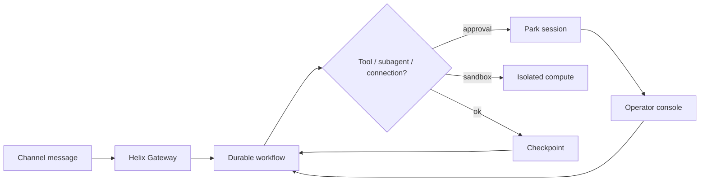

<p align="center">
  
</p>

<h1 align="center">Helix</h1>

<p align="center">
  <strong>The framework for building agents.</strong><br/>
  Filesystem-first. Durable by default. Full local stack — gateway, workflows, sandbox, channels, connections, subagents, schedules, evals.
</p>

<p align="center">
  <a href="https://letslego.github.io/helix/">Docs site</a> ·
  <a href="#quick-start">Quick start</a> ·
  <a href="#the-helix-stack">Stack</a> ·
  <a href="#demo">Demo</a>
</p>

---

## Demo

https://github.com/letslego/helix/raw/main/docs/site/assets/helix-demo.mp4

[](https://letslego.github.io/helix/#demo)

---

## An agent is a directory

```text
my-agent/
├── agent/
│   ├── instructions.md
│   ├── agent.ts                 # model, gateway routes, budgets
│   ├── policies.json
│   ├── tools/
│   ├── skills/
│   ├── sandbox/sandbox.ts
│   ├── channels/
│   ├── connections/
│   ├── subagents/
│   └── schedules/
└── evals/suite.ts
```

## The Helix stack

Core primitives ship as [separate repos](https://github.com/letslego/helix-ecosystem) and are re-exported from `@letslego/helix` (see [docs/stack.md](docs/stack.md)):

| Primitive | Package | What it does |
| --- | --- | --- |
| **Workflows** | [`@letslego/helix-workflow`](https://github.com/letslego/helix-workflow) | Step replay under `.helix/workflows/` — park & resume |
| **AI Gateway** | [`@letslego/helix-gateway`](https://github.com/letslego/helix-gateway) | Intent routing, fallback chains, cost budgets |
| **Sandbox** | [`@letslego/helix-sandbox`](https://github.com/letslego/helix-sandbox) | Isolated FS + glob/grep/allowlisted bash |
| **Connect** | [`@letslego/helix-connect`](https://github.com/letslego/helix-connect) | Brokered MCP/OpenAPI auth — secrets never enter prompts |
| **Channels** | [`@letslego/helix-channels`](https://github.com/letslego/helix-channels) | HTTP, web console, Slack, Discord adapters |
| **Tools** | (in Helix) | `defineTool` + `always/once/never/when`, streaming yields |
| **Subagents** | (in Helix) | Specialists with isolated sandboxes via `delegate_subagent` |
| **Domain router** | (in Helix) | Capability cards → `route_domains` / `delegate_domains` |
| **Context packs** | (in Helix) | `agent/context/**` org/tenant/policy slices for specialists |
| **Policy sidecar** | (in Helix) | K8s hybrid mode: PDP authorize + resolve `policy:*` on localhost |
| **Deploy** | `deploy/helm`, `Dockerfile` | Docker images + Helm chart (sidecar in-pod); see [deploy/README.md](deploy/README.md) |

Also included: schedules, evals, memory, policies. Templates: [helix-templates](https://github.com/letslego/helix-templates). Overview: [helix-ecosystem](https://letslego.github.io/helix-ecosystem/).

Client SDKs for `/helix/v1`: [TypeScript](https://github.com/letslego/helix-sdk) · [Python](https://github.com/letslego/helix-sdk-python) · [Go](https://github.com/letslego/helix-sdk-go).

```bash
helix stack          # print discovered stack map
helix console        # operator UI + HTTP API
helix schedule       # list / fire schedules
helix eval           # run evals/suite.ts
helix replay <id>    # forensic event log
```

---

## Quick start

```bash
npx @letslego/helix init my-agent
cd my-agent
npm install
npx helix console
```

Open `http://127.0.0.1:8787`. API surface also serves `/helix/v1/*`.

### Tools & workflows

```ts
import { defineTool, z, always, toolOutput } from "@letslego/helix/tools";

export default defineTool({
  description: "Hold a flight",
  approval: always(),
  inputSchema: z.object({ flight: z.string(), passenger: z.string() }),
  async *execute(input, ctx) {
    yield { phase: "reserving" };
    const holdId = `HOLD-${input.flight}`;
    yield { phase: "done", holdId };
  },
  toModelOutput(out) {
    return toolOutput.text(`Hold ready: ${(out as { holdId: string }).holdId}`);
  },
});
```

See [docs/tools.md](docs/tools.md) and [docs/workflows.md](docs/workflows.md).

### Gateway + sandbox

```ts
import { defineAgent } from "@letslego/helix";

export default defineAgent({
  model: "mock/helix-demo",
  fallbackModels: ["openai/gpt-4.1-mini"],
  provider: { mock: true },
  gateway: {
    defaultModel: "mock/helix-demo",
    routes: { research: "mock/helix-demo" },
  },
  costBudgetUsd: 1,
});
```

---

## Travel example

```bash
npm install
npm run demo
npx tsx src/cli.ts stack examples/travel-agent
npx tsx src/cli.ts eval examples/travel-agent/evals/suite.ts -d examples/travel-agent
npx tsx src/cli.ts console examples/travel-agent
```

Includes flights/weather tools, approval-gated booking, sandbox, places connection, researcher subagent, Friday schedule, and eval suite.

---

## How a turn works



---

## Development

```bash
npm install
npm test
npm run demo
bash scripts/make-demo-video.sh
```

## License

Apache-2.0 © LetsLego
