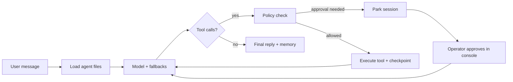

<p align="center">
  
</p>

<h1 align="center">Helix</h1>

<p align="center">
  <strong>Filesystem-first framework for durable AI agents.</strong><br/>
  Markdown for instructions and skills. TypeScript for tools. Checkpoints on disk.<br/>
  Local-first. Provider-agnostic. Built to be inspected.
</p>

<p align="center">
  <a href="https://letslego.github.io/helix/">Docs site</a> ·
  <a href="#quick-start">Quick start</a> ·
  <a href="#demo">Demo</a> ·
  <a href="#why-helix">Why Helix</a>
</p>

---

## Demo

Watch Helix load a travel agent from files, call tools, checkpoint the run, and explain how operators use the console:

https://github.com/letslego/helix/raw/main/docs/site/assets/helix-demo.mp4

[](https://letslego.github.io/helix/#demo)

Or browse the showcase site: **[letslego.github.io/helix](https://letslego.github.io/helix/)**

---

## What you get

A Helix agent is a directory. Paths define capabilities:

```text
my-agent/
└── agent/
    ├── agent.ts            # model, fallbacks, budgets
    ├── instructions.md     # always-on system prompt
    ├── policies.json       # approvals / deny lists
    ├── tools/              # typed functions the model can call
    │   └── get_weather.ts
    └── skills/             # procedures loaded on demand
        └── be_concise.md
```

Helix discovers those files, runs a durable loop, and writes an event timeline under `.helix/` so you can pause, approve, resume, and replay.

### Improvements that matter in production

| Capability | What it means day to day |
| --- | --- |
| **Local-first durability** | Sessions, checkpoints, and event logs live on disk — no cloud workflow dependency to develop or debug. |
| **Provider-agnostic runtime** | Mock provider for demos/CI, OpenAI-compatible APIs for production, plus model fallback chains. |
| **Cost budgets** | Estimated token spend is tracked per session; runs can stop when a budget is hit. |
| **Policy files** | Approval gates and deny lists are data, not buried conditionals. |
| **Memory vault** | Episodic/preference memory persists across sessions in `.helix/memory.json`. |
| **Operator console** | Built-in web UI with conversation + durable timeline side by side. |
| **Replay debugging** | `helix replay <sessionId>` prints every model/tool/approval event. |
| **Node 20+** | Practical engine requirement for modern teams. |

---

## Quick start

Requirements: Node.js 20+.

```bash
npx @letslego/helix init my-agent
cd my-agent
npm install
npx helix console
```

Open `http://127.0.0.1:8787`, ask a question, and watch the timeline update.

### A minimal tool

`agent/tools/get_weather.ts`:

```ts
import { defineTool, z } from "@letslego/helix/tools";

export default defineTool({
  description: "Return mock weather data for a city.",
  inputSchema: z.object({ city: z.string().min(1) }),
  async execute({ city }) {
    return { city, condition: "Sunny", temperatureF: 72 };
  },
});
```

### Choose models and budgets

`agent/agent.ts`:

```ts
import { defineAgent } from "@letslego/helix";

export default defineAgent({
  model: "mock/helix-demo",
  fallbackModels: ["openai/gpt-4.1-mini"],
  provider: { mock: true }, // set mock:false + OPENAI_API_KEY for live models
  costBudgetUsd: 1,
});
```

### CLI

```bash
helix init my-agent      # scaffold
helix inspect           # show discovered tools/skills/policies
helix run "..."         # one durable turn
helix console           # operator UI
helix replay <id>       # print event log
helix dev               # inspect + console
```

---

## Travel example

This repository includes a ready-to-run concierge agent:

```bash
npm install
npm run demo
# or
npx tsx src/cli.ts console examples/travel-agent
```

It demonstrates:

1. Multi-tool planning (`search_flights`, `get_weather`)
2. Approval-gated side effects (`book_hold`)
3. Skill-guided answer shape
4. Memory writes and replayable checkpoints

---

## How a turn works



Everything lands in `.helix/sessions/` and `.helix/events.jsonl`.

---

## Why Helix

Most agent stacks optimize for a single cloud runtime or hide critical behavior behind opaque SDKs. Helix optimizes for **operability**:

- You can read the agent without running it.
- You can run it without the internet (mock provider).
- You can explain what happened after the fact (replay).
- You can put a human in the loop before irreversible tools fire.

---

## Project layout (this repo)

```text
helix/
├── src/                 # framework runtime + CLI
├── examples/travel-agent
├── docs/site/           # GitHub Pages showcase
├── scripts/make-demo-video.sh
└── test/
```

---

## Development

```bash
npm install
npm run typecheck
npm test
npm run demo
npm run console -- examples/travel-agent
```

Generate the README/site demo video (macOS; uses `say` + `ffmpeg`):

```bash
bash scripts/make-demo-video.sh
```

---

## License

Apache-2.0 © LetsLego
